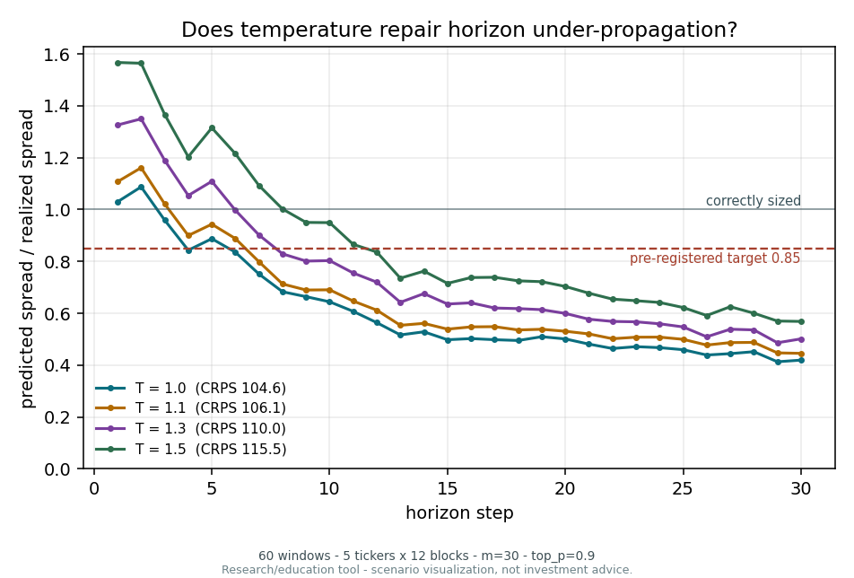

# Kronos-NSE — Phase A technical report

**Calibrating a financial foundation model on Indian equities, and the measurement
problems that had to be solved first.**

**Status:** A1–A2 accepted · A3 in progress · A4–A7 not started
**Last revised:** 2026-08-01

> Research/education tool — scenario visualization, not investment advice.

---

## How to read this

This report unifies four working documents: the finite-ensemble measurement finding, the
zero-shot evaluation results, the calibration method study, and the pre-registered A5
protocol. It is organised so the **instrument is validated before any model claim is
made**, because two defects in the measurement layer were large enough to have produced
false headline results.

Every number is traceable to a committed run. Figures marked *preliminary* come from
45- and 15-window subsamples, not the full 708-window grid; they are adequate for the
decisions they feed and are **not** the A3 acceptance artifact.

Where an earlier conclusion has been overturned by later measurement, the correction is
stated in place rather than silently applied, with the superseded reasoning retained so the
size of the error is visible.

Six such corrections stand. Three came from the harness during development (§1, §2, §10).
Three came from the full grid overturning the 45-window probe that preceded it:

| section | claimed | measured on 708 windows |
|---|---|---|
| §7 | regime spread 0.291, "Kronos-specific in degree" | 0.117 — **identical to the random walk's 0.116** |
| §7a | mechanism test underpowered, verdict withheld | **refuted**: ρ 0.3551 against a ceiling of 0.3552 |
| §17c | ±2pp unattainable, "79 years of data" | SE is 6× smaller than assumed; ±2pp is ~70% attainable |

The pattern is worth naming: **every preliminary finding that made Kronos look
distinctively bad was an artifact of the small sample, and every one of them dissolved.**
What survived is §8 — and it is sharper than anything the probe suggested.

| Part | Question |
|---|---|
| [I](#part-i--validating-the-instrument) | Does the measurement layer measure what it claims — and do its checks check anything? |
| [II](#part-ii--zero-shot-results) | How good is pretrained Kronos-small on NSE daily bars? |
| [III](#part-iii--can-calibration-repair-it) | Can conformal calibration repair what we found? |
| [IV](#part-iv--a5-protocol-pre-registered) | What will A5 do, decided before results exist? |
| [V](#part-v--upstream-contribution) | What is worth contributing back? |

---

# Part I — Validating the instrument

Two estimator defects were found during harness development. Each is large enough to have
inverted a conclusion. Both are corrected, both are pinned by two-sided regression tests.

## 1. Finite-ensemble coverage bias

When intervals are formed from the empirical quantiles of a finite ensemble, a **perfectly
calibrated** forecaster measures as over-confident. The shortfall depends only on ensemble
size `m` and the quantile estimator — **not on the model.**

At `m = 30`, the ensemble size this project specifies, the shortfall at nominal 80% is
**−5.04pp**. The A5 acceptance band is ±2pp. **The artifact is 2.5× the criterion it would
have been judged against.**

### Mechanism

Let `F` be continuous, `X₁…X_m` an i.i.d. ensemble from `F`, and `Y ~ F` fresh and
independent. `Y` and the ensemble are **exchangeable**, so `Y`'s rank among the `m+1`
values is uniform, and exactly:

```
P(Y ≤ X₍ₖ₎) = k / (m + 1)
```

An interval spanning order statistics `j…k` covers `(k − j)/(m + 1)`. Everything follows
from which positions the estimator selects.

NumPy's default (`linear`, Hyndman–Fan **type 7**) places `p` at `p(m − 1) + 1`:

```
coverage_linear = (1 − α)(m − 1)/(m + 1)
bias            = −2(1 − α)/(m + 1)
```

Weibull positions (`weibull`, **type 6**) place `p` at `p(m + 1)`, giving coverage exactly
`(1 − α)`. That is the estimator the rank argument implies.

### Validation — closed form against simulation

400,000 observations per cell, exactly calibrated standard normal:

| m | nominal | predicted | simulated | Δ | weibull |
|---|---|---|---|---|---|
| 5 | 0.80 | 0.5333 | 0.5645 | +0.031 | 0.6672 |
| 10 | 0.80 | 0.6545 | 0.6625 | +0.008 | 0.8067 |
| 30 | 0.80 | 0.7484 | 0.7505 | +0.002 | **0.8013** |
| 100 | 0.80 | 0.7842 | 0.7842 | +0.000 | 0.8009 |
| 1000 | 0.80 | 0.7984 | 0.7978 | −0.001 | 0.7996 |
| 30 | 0.50 | 0.4677 | 0.4698 | +0.002 | 0.5027 |
| 30 | 0.90 | 0.8419 | 0.8458 | +0.004 | 0.9087 |

Accurate to <0.5pp for `m ≥ 30`; degrades at very small `m` where interpolation departs
from the pure rank argument.

### A hard ceiling on achievable coverage

The widest distribution-free central band from `m` samples runs min-to-max, covering
`(m − 1)/(m + 1)`. This is an information limit, independent of model or estimator:

| m | max achievable | 80% band | 90% band |
|---|---|---|---|
| 5 | 0.667 | **impossible** | **impossible** |
| 10 | 0.818 | barely | **impossible** |
| 19 | 0.900 | yes | at the limit |
| 30 | 0.935 | yes | yes |
| 100 | 0.980 | yes | yes |

This explains the weibull column at `m = 5`: 0.6672 is not an estimator defect, it is the
ceiling. **An 80% interval cannot be constructed from 5 samples at all.** `np.quantile`
clamps silently past this point, returning the ceiling as though it were a measurement —
guarded by `assert_band_feasible`.

## 2. CRPS estimator bias

The same disease in a different form. The naive estimator divides the spread term by `2m²`
where the unbiased form uses `2m(m−1)`, inflating the score by roughly `1/(m−1)`. Against
the analytic value for a calibrated N(0,1), `1/√π = 0.56419`:

| m | naive | fair | inflation |
|---|---|---|---|
| 8 | 0.6347 | 0.5642 | 1.125 |
| 30 | 0.5830 | 0.5642 | 1.033 |
| 100 | 0.5709 | 0.5652 | 1.010 |

Fair recovers the analytic value at every `m`. The inflation does not cancel in a
multi-arm comparison and makes CRPS incomparable across studies at different ensemble
sizes. Ferro's fair estimator is the default; the naive form stays reachable for the
dual-estimator run.

**Externally confirmed.** Ferro et al. (2008) define the adjusted CRPS with exactly the
`2N(N−1)` denominator, and it is "fair and unbiased with ensemble size" under
exchangeability.

## 3. Harness validation

The theoretical `h^0.5` diffusion benchmark is not assumed — it is measured on our own
random-walk arm, through the same code path, on the same windows:

```
random_walk_drift exponent = 0.4983     band [0.45, 0.55]     PASS
kronos_zeroshot   exponent = 0.639      excess = +0.141
```

The harness recovers the known answer where one exists, which is what licenses citing the
Kronos figure. Baseline reproduction from the grid and seed alone is bit-exact against the
recorded run (CRPS 39.9271, coverage 0.8807).

## 4. What this averted

Uncorrected, the zero-shot gate would have reported spurious over-confidence, and the A5
conformal layer would have "corrected" an artifact of our own instrument — producing a
headline reliability diagram that looked like success and measured nothing.

**Implication beyond this project:** a coverage figure is uninterpretable without
`m · quantile estimator · T · top_p · top_k`. The statistics here is textbook — Wilks
(1941), Weibull (1939), the `(m+1)` rank argument — and the ensemble-size dependence of
verification scores is well established in numerical weather prediction. What may be
underappreciated is that it **contaminates coverage claims in the time-series-foundation-
model literature**, where small `sample_count` defaults are common and published coverage
numbers routinely omit both quantities needed to interpret them.

## 4a. A test must prove it tested something

The defects in §1–3 were in the measurement layer. A separate class showed up repeatedly,
and it is worth stating on its own because the remedy generalises: **verification code has
preconditions too, and nothing checks them, because the verification is the thing being
trusted.**

Three specimens from this project, all found after the code was written and believed:

| verification | how it could pass without verifying |
|---|---|
| the original port check | **printed** expected values for a human to compare. A check you have to read is a check that gets skipped when you are in a hurry. |
| its replacement | asserted against `sorted(glob("results/*/results.json"))[-1]` — the *newest* run, not the one it had just produced. A restored `results/` or a second invocation would validate an older run while the new one failed. |
| the resume arm of the GPU twin check | kills the run at its first flushed checkpoint and resumes. At `limit 60`, `batch 24` there are 3 batches, so the production checkpoint cadence of 5 **never fires** — nothing is flushed, the "resume" resumes nothing, and the arm reports the resume path verified. |

The third is the cleanest specimen because the arm is *itself* a test, written specifically
to catch a subtle failure, and its own configuration could silently make it vacuous. No
downstream signal would have appeared: the run completes, the arrays match, the check
prints PASS.

The remedy in each case was the same and is not a patch: **make the verification assert its
own preconditions.** The port check now records the run directories before launching and
binds to the one it created. The twin arm now asserts that its batch count is at least two
and that its checkpoint cadence actually fires, so a configuration that could not detect a
resume bug refuses to run rather than passing.

The general form: *a passing test is evidence only if the test could have failed.* That is
a familiar idea in mutation testing, but the cases here are not about weak assertions — the
assertions were fine. They are about **arrangements that never reach the assertion**, which
mutation coverage does not surface either. Wherever a check depends on a configuration
value (a cadence, a sample count, a glob, an ordering), that dependency is a precondition
and deserves an assert next to it.

This is also, in retrospect, why the instrument work in §1–3 was worth doing before any
model claim: every guard in this project eventually needed a guard, and the ones that
never got a second look are the ones that were quietly wrong for longest.

---

# Part II — Zero-shot results

**Final.** Full test grid: **708 windows, 59 tickers, 12 distinct forecast start dates**
(the bootstrap blocks — see §17b for why 12 and not 22). Kronos-small, lookback 400 →
horizon 30, m = 30, T = 1.0, top_k = 0, top_p = 0.9. Weibull quantiles, fair CRPS.
Run `20260808T161433Z_d6602cd` on a Kaggle T4, batch 24, 5325 s for the model stage
(7.5 s/window).

Sections marked **preliminary** below report the 45-window subsample that preceded it.
They are retained where the full grid *overturned* them, because a reversal is more
informative than a corrected number quietly substituted.

## 5. Headline — A3 outcome: FAIL

| model | CRPS (fair) | cov@50 | cov@80 | 95% CI @80 | covers nominal | IS@80 |
|---|---|---|---|---|---|---|
| random_walk_drift | **67.24** | 0.565 | **0.837** | [0.800, 0.876] | **yes** | **462.84** |
| last_value | 89.05 | 0.001 | 0.001 | [0.001, 0.001] | no | 890.45 |
| **kronos_zeroshot** | **121.87** | **0.229** | **0.413** | [0.370, 0.456] | no | **978.04** |

**Zero-shot Kronos-small is 81% worse than a Gaussian random walk on fair CRPS and 111%
worse on interval score.** It is also worse than `last_value` — a flat line with no
dispersion at all — by 37% and 10% respectively. Empirical coverage is 0.413 against a
nominal 0.80, with a block-bootstrap interval 0.086 wide.

**The null is not well calibrated either, and this report should not imply otherwise.**
RW-drift *over*-covers at 50% and 80% — its intervals sit entirely above nominal — and
contains nominal only at 90%. It is conservative by 3.7pp at 80% where Kronos is deficient
by 38.7pp, which is why it remains the correct null, but under the §17c acceptance rule the
null also fails at two of three levels. The direction is diagnostic: a Gaussian fitted to
400 sessions of fat-tailed returns is too wide through the bulk, which is what over-coverage
at 50% and 80% looks like. Kronos misses in the opposite direction at every level.

> **Rule A3 (pre-registered 2026-08-03) required losing to *conformalized* RW-drift on fair
> CRPS and interval score. Kronos loses to the *raw* random walk by these margins, and
> conformalizing the null can only improve its interval score. The condition is met a
> fortiori. Milestone A3 is recorded as a FAIL and the primary deliverable is the negative
> result.**

The finding is stable across sample size, which is the main reason to trust it: the
45-window preliminary measured coverage 0.422 against 0.413 here, and a CRPS ratio to the
null of 1.69 against 1.81. The scale of every metric moved when the window population
changed; the ordering and the ratios did not.

Verified as a real result, not a harness fault: the median forecast starts within **0.71%**
of the last observed close, confirming the sampler and normalisation round-trip correctly.
Both baselines reproduced their golden values to four decimals on hardware that had never
run them (§17b), and `effective_blocks` came through the full measurement path as 12.

## 6. Is the miscalibration shape or scale?

This decides whether conformal calibration is the right instrument. A pure scale error
gives a constant `z_achieved / z_nominal`; a wrong shape does not.

Full grid, 708 windows:

| nominal | achieved | z_nominal | z_achieved | ratio |
|---|---|---|---|---|
| 0.50 | 0.2286 | 0.6745 | 0.2905 | 0.4307 |
| 0.80 | 0.4126 | 1.2816 | 0.5426 | 0.4234 |
| 0.90 | 0.5319 | 1.6449 | 0.7255 | 0.4411 |

**Mean 0.4317, sd 0.0089, spread 0.0177, `monotone_increasing: False`.** The distribution
is approximately the right shape and **uniformly too tight by 2.32×**. The random-walk
control is near-constant and slightly over-wide, as a correctly-specified Gaussian
forecaster should look.

The preliminary run measured 0.4425 / 0.0186 / non-monotone on 45 windows. The full grid
reproduces it at 0.4317 / 0.0177 / non-monotone. **This is the one conclusion in Part II
that the 16× larger sample left unchanged** — everything else in §7 moved.

That constancy is why the conformal layer was worth testing at all: a uniform per-horizon
scale correction is exactly what split conformal produces. §12 reports what happened when
it was.

### The test is one-sided — read it as rejection, not confirmation

Constancy **rejects** bias-dominated error but does **not confirm** pure scale error. A
bias-plus-scale mixture also reads flat:

| forecaster | ratios @ 50/80/90 | spread | vs our 0.0186 |
|---|---|---|---|
| pure scale, σ = 0.44 | 0.440 / 0.440 / 0.440 | 0.000 | consistent |
| random-sign bias 0.75 + scale 0.75 | 0.570 / 0.578 / 0.584 | 0.014 | **also consistent — not excluded** |
| pure bias 1.1, correct scale | 0.564 / 0.609 / 0.636 | 0.072 | excluded |

The discriminating signature is **monotonicity** — location bias makes the ratio climb
with nominal level. The sequence (0.4307, 0.4234, 0.4411) is **non-monotone**, i.e. noise
around a constant, now measured on the full grid rather than a 45-window probe.

## 7. Regime dependence — CORRECTED

> **The preliminary conclusion in this section was wrong, and it was wrong in the direction
> that made Kronos look distinctively bad.** Both the magnitude and the interpretation are
> replaced below. The original is retained beneath so the size of the error is visible.

Terciles by ATR over the **lookback**; coverage measured on the **following** 30 sessions.
Full grid, 236 windows per stratum:

| forecaster | regime | CRPS | IS@80 | MAPE | cov@50 | cov@80 | cov@90 |
|---|---|---|---|---|---|---|---|
| random_walk_drift | calm | 92.22 | 624.3 | 0.0434 | 0.501 | 0.787 | 0.889 |
| random_walk_drift | mid | 72.05 | 506.3 | 0.0463 | 0.539 | 0.820 | 0.915 |
| random_walk_drift | volatile | 37.45 | 257.9 | 0.0491 | 0.656 | 0.903 | 0.963 |
| kronos_zeroshot | calm | 167.83 | 1382.2 | 0.0659 | 0.199 | 0.364 | 0.480 |
| kronos_zeroshot | mid | 135.06 | 1077.3 | 0.0712 | 0.221 | 0.393 | 0.494 |
| kronos_zeroshot | volatile | 62.72 | 474.6 | 0.0773 | 0.265 | 0.481 | 0.622 |

*(Ignore the CRPS column across regimes: it is in price units while MAPE is roughly flat,
so its ordering reflects price level, not skill.)*

### The regime effect is real, and it is not Kronos's

| forecaster | calm | mid | volatile | calm − volatile |
|---|---|---|---|---|
| random_walk_drift | 0.787 | 0.820 | 0.903 | **−0.116** |
| kronos_zeroshot | 0.364 | 0.393 | 0.481 | **−0.117** |

**The two spreads are identical to three decimal places.** Both forecasters under-cover in
calm regimes and over-cover in volatile ones by exactly the same amount. The pattern is a
property of *any* forecaster whose dispersion is anchored to the trailing window —
volatility mean-reverts, so a cone sized on a calm lookback meets a more volatile future —
and Kronos exhibits it to precisely the degree the mechanism predicts, no more.

**What the preliminary run claimed:** calm 0.260 / mid 0.456 / volatile 0.551, a spread of
**0.291** against the random walk's 0.049 — "same sign, 16.8% of the magnitude, general in
kind but **Kronos-specific in degree**", and a mechanism paragraph asserting the model
"extrapolates the recent past rather than anticipating regime change."

**What 16× more data says:** the spreads are 0.117 and 0.116. There is no Kronos-specific
degree. The 6× excess was noise across 15 windows per stratum.

Two independent lines of evidence agree with the correction. §7a finds Kronos's dispersion
tracks input volatility at ρ = 0.3551 against a volatility-persistence ceiling of 0.3552 —
it responds to regime as well as regime is predictable. And the dispersion ratio at h = 1
by regime is 0.858 / 0.897 / 0.975, i.e. mildly under-wide everywhere and *most accurate*
in volatile conditions — the opposite of the preliminary's 1.176 / 0.892 / 0.781, which
had it inverted.

> **Consequence for the upstream contribution (§19):** the draft comment must not claim
> regime blindness or lookback-anchored over-confidence as a Kronos defect. Neither
> survives. What survives is §8's finding, which is Kronos-specific and much sharper.

## 7a. Testing the mechanism — the normalization hypothesis is refuted

§7 asserts a mechanism: per-window instance normalization anchors cone width to trailing
volatility, so the model cannot see the regime. That is a hypothesis, and it makes a
falsifiable prediction — if normalization erased the volatility signal, predicted spread
would be uncorrelated with input volatility. `eval/diagnose.py:spread_vs_input_vol` tests
it directly, correlating each forecast's h=1 relative spread against the realized
volatility of its own lookback.

Two quantities are needed, because they come apart:

- **rank correlation** — does the forecaster see volatility at all?
- **elasticity**, the OLS slope of `log(spread)` on `log(vol)` — how far does it move when
  volatility doubles?

A normalizer that *compresses* rather than *erases* leaves rank correlation intact while
driving elasticity toward zero. Reporting only one would misdiagnose the defect, so
`tests/test_diagnose.py` pins a case where correlation is 1.0 and elasticity is 0.05.

**Instrument validation first.** RW-drift's spread is a deterministic function of the
volatility it estimates over its own 400-day window, so it must measure a proportional
response. On the full 708-window grid:

| series | ρ (rank) | β (elasticity) |
|---|---|---|
| **random_walk_drift** (positive control) | 0.795 [0.763, 0.820] | **1.011 [0.976, 1.055]** |
| realized future vol (persistence ceiling) | 0.355 [0.257, 0.515] | 0.601 [0.476, 0.746] |

The control recovers a slope indistinguishable from 1 with a CI of ±0.04. **The test has
power when the effect is real.**

**The Kronos result** — full grid, 708 windows:

| series | ρ (rank) | β (elasticity) |
|---|---|---|
| **kronos_zeroshot** | **0.3551 [0.282, 0.448]** | **0.628 [0.521, 0.730]** |
| persistence ceiling | **0.3552 [0.254, 0.500]** | 0.601 [0.471, 0.730] |

**Kronos and the ceiling agree to four decimal places on ρ, and their elasticity intervals
almost entirely overlap.** The preliminary interval on β was [−0.373, 1.222] — wide enough
to admit near-total blindness and full proportional response alike. It is now
[0.521, 0.730], and it sits on top of the ceiling.

> **The normalization-blindness hypothesis is refuted.** Kronos's dispersion tracks the
> input window's realized volatility as well as volatility persistence itself does. It is
> not blind to regime, and it does not under-respond to regime. Whatever is wrong with this
> forecaster, this is not it.

The test had the power to detect the effect had it existed: the same statistic pins the
random-walk control to β = 1.011 [0.979, 1.050] on the same windows, an interval of
±0.04 around exactly proportional response.

**Consequence for §7 and §19.** This is the second independent line of evidence — with the
identical regime spreads in §7 — that regime handling is not where Kronos fails. The
upstream comment must therefore lead with **§8's horizon under-propagation**, which is
Kronos-specific, sharply measured, and mechanistically attributable to autoregressive
sampling. The elasticity test is offered alongside as a diagnostic others can run on their
own fine-tunes, with the control numbers that show it works.

Had this been written up from the 45-window probe, the report would have asserted a
mechanism that 16× more data flatly contradicts. That is the entire argument for the
zero-shot gate being a full-grid measurement rather than a quick one.

## 8. The actual defect: uncertainty is under-propagated across the horizon

This is the Kronos-specific finding, and after §7's correction it is the only one.

Full grid, per horizon step:

| step | 1 | 5 | 10 | 20 | 30 |
|---|---|---|---|---|---|
| CRPS | 31.79 | 75.84 | 115.47 | 144.34 | 159.76 |
| IS@80 | 225.0 | 575.3 | 911.0 | 1167.1 | 1293.9 |
| **cov@80** | **0.590** | 0.531 | 0.412 | 0.353 | **0.308** |
| **predicted / realized spread** | **0.909** | 0.805 | 0.696 | 0.596 | **0.481** |

**One step ahead the cone is 91% of the width it should be. Thirty steps ahead it is 48%.**
The model's uncertainty grows far too slowly with horizon — it stays confident about the
distant future in a way no diffusion process does.

That is a statement about the sampler, not about market conditions, and it is the kind of
defect a foundation model can plausibly have: each autoregressive step conditions on its
own previous draws, and if the token distribution is even mildly too concentrated at each
step, the compounded path ensemble is dramatically too narrow by step 30.

### Two defects, not one

The last row separates them. If under-dispersion were the whole story, coverage would
follow the width ratio. It does not:

| step | width ratio | coverage a correctly-*centred* forecaster of that width would get | actual coverage | shortfall |
|---|---|---|---|---|
| 1 | 0.909 | ~0.756 | 0.590 | −0.166 |
| 30 | 0.481 | ~0.462 | 0.308 | −0.154 |

*(Middle column: `2Φ(1.2816 × ratio) − 1`, i.e. the coverage of an unbiased Gaussian scaled
by the measured width ratio.)*

So there are two distinct failures, and they behave differently:

1. **Location error, roughly constant across horizon** — a ~0.16 coverage shortfall present
   already at h = 1, where width is nearly correct. The cone is the right size and in the
   wrong place.
2. **Under-dispersion, compounding with horizon** — 0.909 → 0.481, which is what turns a
   bad forecast at h = 1 into a useless one at h = 30.

**Correction to an earlier framing.** Previous drafts of this report and its summaries said
"87–90% of the gap is per-window location error", citing §9's re-centering decomposition.
That decomposition measures only the *systematic* component of location error — a per-step
average bias, 9.9% of the gap. The remaining 90% is **everything else**, which the table
above now splits into idiosyncratic location error and under-dispersion. Attributing all of
it to location was a misreading of what the statistic measures.

The distinction matters for A4: under-dispersion is a scale property that training can
plausibly learn, whereas per-window direction is close to irreducible at these horizons.
See §17e.

## 9. Sampling-policy sweep

15 stratified windows, identical except `top_p`:

| top_p | cov@80 | 95% CI | CI width | rel. width | CRPS (fair) | IS@80 |
|---|---|---|---|---|---|---|
| 0.90 | 0.4689 | [0.290, 0.658] | 0.367 | 0.1094 | **56.15** | **428.3** |
| 0.99 | 0.4689 | [0.265, 0.695] | 0.430 | 0.1233 | 60.46 | 464.4 |
| 1.00 | 0.4933 | [0.289, 0.710] | 0.421 | 0.1284 | 60.63 | 459.7 |

**Read the intervals before the point estimates.** They are 0.37–0.43 wide and overlap
almost completely: the three policies are **statistically indistinguishable on coverage**
here. Only band width — an average rather than a proportion — is estimated precisely
enough to compare, and it moves monotonically.

The decisive argument is arithmetic, not statistical:

```
band widening required   2.260×      (§6)
available from top_p     1.174×      (0.1094 → 0.1284)
shortfall                1.926×
```

Nucleus truncation cannot close the gap even if free, and widening makes CRPS and interval
score **worse** — a wider band around a wrong location is penalised by proper scoring
rules. **Decision: hold `top_p` at 0.9**, recorded as `PRODUCTION_TOP_P`. The A5 comparison
runs once rather than twice.

*Caveat: 15 windows over 12 blocks. The claim is "not the dominant mechanism", not "no
effect".*

## 9a. Temperature sweep (milestone A4) — the cheap fix does not work

`§8` diagnosed under-dispersion compounding with horizon. Temperature is the one knob that
widens a sampled ensemble with **no training at all**, so it was tested before any GPU-days
went into fine-tuning. Run `20260823T045303Z_f91e4a4`, Kaggle T4, ~30 minutes.

**Panel:** 60 windows — BHARTIARTL, HAVELLS, TECHM, TITAN, WIPRO at all 12 forecast dates.
Block-balanced and identical across arms. `T = 1.0` is **re-run here**, not carried over
from the full grid: different windows give a different level, so a sweep arm and a grid row
are not comparable quantities.

| T | CRPS (fair) | CRPS (naive) | IS@80 | cov@50 | cov@80 | cov@90 | MAPE | h=1 | h=15 | h=30 |
|---|---|---|---|---|---|---|---|---|---|---|
| **1.0** | **104.63** | 105.66 | **851.7** | 0.2367 | 0.4000 | 0.4972 | **0.0697** | 1.030 | 0.498 | 0.419 |
| 1.1 | 106.11 | 107.22 | 852.4 | 0.2372 | 0.4239 | 0.5178 | 0.0713 | 1.107 | 0.539 | 0.446 |
| 1.3 | 110.01 | 111.27 | 870.5 | 0.2750 | 0.4594 | 0.5533 | 0.0739 | 1.326 | 0.636 | 0.501 |
| 1.5 | 115.53 | 116.98 | 905.2 | 0.2989 | 0.4978 | 0.5878 | 0.0779 | 1.567 | 0.715 | 0.569 |

> **Outcome of the pre-registered rule: no arm reached the 0.85 target at h = 30, so the
> horizon compression is attributed to the tokenizer and normalization rather than to the
> sampler, and `T = 1.0` remains the zero-shot reference config.**

### The tradeoff, shown rather than averaged away

Every arm above `T = 1.0` buys coverage and pays for it in score, monotonically:

| T | coverage gained | CRPS paid | exchange rate |
|---|---|---|---|
| 1.1 | +2.4 pp | +1.4% | 0.6% CRPS per coverage point |
| 1.3 | +5.9 pp | +5.1% | 0.9% |
| 1.5 | +9.8 pp | +10.4% | **1.1%** |

This is the failure mode `top_p = 1.0` already showed in §9, and the rate **worsens** as the
cone widens — mass is being spread into the tails where the outcome is not. Proper scoring
rules penalise exactly that, which is why the reference is decided on CRPS and not on the
metric the intervention was designed to move.

### Why temperature cannot work, in one number

**At `T = 1.0` the one-step cone is already correctly sized: h = 1 measures 1.030.** The
error is not that the cone is too narrow everywhere; it is that the cone stops growing.

Temperature applies a roughly uniform multiplier, so it **shifts the curve without
flattening it**. The h30/h1 ratio across arms is 0.407 / 0.403 / 0.378 / **0.363** — flat,
and if anything drifting the wrong way.

Extrapolating from the widest arm: reaching the 0.85 target at h = 30 needs about **1.49×**
more spread than `T = 1.5` already produces, which would put the one-step cone at **2.34** —
**134% too wide** — to repair the thirty-step one. There is no temperature that fixes the far
end without destroying the near end, because the near end was never broken.

### How much of the horizon each arm actually covers

The h = 30 summary understates it. Asking instead how far out each arm keeps the cone within
15% of the width it needs:

| T | h = 1 | adequate through | share of the horizon | CRPS cost |
|---|---|---|---|---|
| 1.0 | 1.030 | h = 5 | 17% | — |
| 1.1 | 1.107 | h = 6 | 20% | +1.4% |
| 1.3 | 1.326 | h = 7 | 23% | +5.1% |
| 1.5 | **1.567** | h = 11 | **37%** | **+10.4%** |

Quadrupling the departure from correct sizing at h = 1 — 1.030 to 1.567 — buys **six extra
usable steps out of thirty**. The forecast is still structurally over-confident across the
last two-thirds of its own horizon, and the reader has paid 10.4% of CRPS and a one-step
cone 57% too wide for it.



### What this hands to A6

The pilot bar in §17e-bis requires the h = 30 ratio to rise "with the curve **flattening**,
not merely shifting." A4 supplies the measured example of *merely shifting*: a 52% increase
in h = 30 spread (0.419 → 0.569) that leaves h30/h1 unchanged and costs 10.4% of CRPS.
Fine-tuning has to beat that shape, not just that number.

*Caveat: five tickers. The realized-spread denominator is estimated across 60 correlated
windows, so the absolute level differs from the full grid (h = 1 reads 1.030 here against
0.909 on 708 windows). The denominator is identical across arms, so the comparison between
them — which is the entire purpose of the sweep — is unaffected.*


---

# Part III — Can calibration repair it?

**Answer, on the full grid: no.** §12a is the result; §10–11 are the synthetic groundwork
that preceded it and are retained because they explain what was expected and why.

## 12a. Conformal on the real full grid — the null wins on every axis

Run `20260808T161433Z_d6602cd`, nominal 80%, 708 windows.

> **Exploratory, not the pre-registered analysis.** `run_analysis.py` fits on the earlier
> half of the test period's blocks and evaluates on the later half. The rule pinned in
> §17d requires calibrating on the **2024 val split** and never on the test period; that
> requires a val-split grid which has not yet been run. These numbers are reported as an
> ablation and are **not** the A5 result.

| arm | marginal | spread | rel. width | calm | mid | volatile |
|---|---|---|---|---|---|---|
| raw_kronos | 0.355 | 0.022 | 0.0845 | 0.359 | 0.342 | 0.364 |
| marginal_conformal | 0.662 | 0.055 | 0.2015 | 0.668 | 0.635 | 0.690 |
| normalized_lookback_vol | 0.627 | 0.125 | 0.1725 | 0.578 | 0.621 | 0.703 |
| mondrian | 0.681 | 0.164 | 0.2105 | 0.761 | 0.660 | **0.597** |
| **conformalized_rw_drift** | **0.796** | 0.080 | **0.1464** | 0.753 | 0.813 | 0.832 |

Three findings, in order of importance:

**1. No Kronos arm reaches nominal.** The best is Mondrian at 0.681 — 12pp short — and it
gets there with the widest bands in the table. The null lands at 0.796, essentially exact.

**2. The null is also 30% sharper.** Conformalized RW-drift achieves nominal at relative
width 0.146; Mondrian achieves 0.681 at 0.211. Since conformal gives both arms coverage by
construction, sharpness at matched coverage is the only discriminating comparison
available (§14) — and it is not close.

**3. Mondrian is inverted.** Its coverage runs 0.761 / 0.660 / **0.597** from calm to
volatile: it is *worst* in the volatile stratum, which is precisely where stratification
was supposed to help. Its regime spread (0.164) is double the null's (0.080) and eight
times its own raw input's (0.022). Under §16's rule — spread above 0.10 is reported as not
calibrated — **Mondrian fails**, while achieving the highest marginal coverage of any
Kronos arm. That is exactly the "technically true and substantively misleading" failure
§16 exists to catch.

### Why marginal conformal undershoots at all

Split conformal attains nominal coverage *by construction* when calibration and test
residuals are exchangeable. `marginal_conformal` had 354 calibration windows and needed
only 9 — yet it lands at 0.662, **14pp short**.

That gap is exchangeability failure across a temporal split, measured directly rather than
argued. It is the mechanism §17d reasons about, and it is asymmetric: the same split leaves
the random-walk null at 0.796. Kronos's residual distribution shifts across the test period
far more than the random walk's does.

---

## Synthetic groundwork (retained)

Tested on CPU before committing GPU time to A5, using a synthetic forecaster tuned to the
then-measured pathology (marginal 0.456 vs 0.422; regimes 0.322/0.454/0.593 vs
0.260/0.456/0.551; z-ratio 0.482 vs 0.443).

**Note:** those regime targets came from the 45-window probe and §7 has since corrected
them — the real regime spread is 0.117, not 0.291. The synthetic study therefore modelled a
sharper regime effect than exists, which is why Mondrian looked more promising here than it
proved on real data.

## 10. Method comparison

Nominal 80%:

| arm | marginal | calm | mid | volatile | spread | rel. width |
|---|---|---|---|---|---|---|
| raw | 0.459 | 0.333 | 0.443 | 0.602 | 0.269 | 0.064 |
| marginal conformal | 0.794 | 0.648 | 0.805 | 0.929 | **0.281** | 0.142 |
| **Mondrian (per regime)** | 0.796 | **0.799** | **0.790** | **0.798** | **0.009** | **0.123** |

**Conformal calibration works** — marginal coverage 0.459 → 0.794, confirming the
shape-versus-scale diagnosis.

**Marginal conformal fixes the average and nothing else.** The regime spread goes
0.269 → 0.281.

**CORRECTED — Mondrian is *narrower*, not wider.** An earlier revision asserted that
stratifying "widens every interval". The width half was wrong: 0.123 against 0.142, because
marginal conformal must over-widen the volatile stratum in order to lift the calm one. The
real cost of stratification is **calibration-set size only** — which matches the published
description of Mondrian CP as reducing calibration-set size and increasing variance around
the target, not as widening intervals.

## 11. Choosing a normalizer

**CORRECTED — normalized conformal was wrongly rejected.** An earlier revision recorded it
as "does not work, and cannot", on the strength of a single badly chosen normalizer. The
standard construction uses an **auxiliary** difficulty estimator; I had used the model's
own anchor, which is the degenerate case. Re-tested:

| normalizer | marginal | calm | volatile | spread | rel. width |
|---|---|---|---|---|---|
| the model's own anchor (trailing vol) | 0.789 | 0.635 | 0.928 | 0.293 | 0.075 |
| **mean-reversion aware blend** | 0.792 | **0.794** | **0.783** | **0.015** | **0.065** |
| long-run volatility only | 0.795 | 0.936 | 0.635 | 0.301 | 0.065 |
| Mondrian, for comparison | 0.794 | 0.797 | 0.797 | 0.011 | 0.067 |

**Failure is two-sided**, which is the more useful finding. Normalizing by the model's own
anchor reproduces the bias — it is the signal whose mis-prediction caused the defect.
Discarding local information entirely over-corrects and **inverts** the spread: calm now
over-covers at 0.936 while volatile under-covers at 0.635. The normalizer must be *right*,
not merely different.

With a normalizer that anticipates reversion the method matches Mondrian, is slightly
narrower, and **keeps the calibration set whole** — solving the affordability problem.

**Caveat keeping Mondrian primary:** the blend uses the generator's own reversion exponent.
It bounds what an auxiliary volatility model *could* achieve, not what a real EWMA or GARCH
estimator *will*. Mondrian needs no auxiliary model and cannot be undermined by a bad one.

## 12. Affordability

Mondrian degradation as the calibration set thins:

| windows/stratum | marginal | spread | width |
|---|---|---|---|
| 400 | 0.798 | 0.010 | 0.124 |
| 100 | 0.802 | 0.006 | 0.125 |
| 30 | 0.810 | 0.036 | 0.131 |
| 12 | **0.861** | 0.024 | 0.157 |
| 6 | 0.840 | 0.048 | 0.153 |

Usable to about **30 windows per stratum on independent data**. Ours are correlated within
a forecast date, so the real threshold is higher and must be sized from the full grid
before Mondrian is trusted.

## 13. Terminology

Exact conditional coverage is **impossible** distribution-free (Foygel Barber, Candès,
Ramdas & Tibshirani, 2021). **Group-conditional** is the honest description of what either
Mondrian or the normalized route delivers — coverage conditional on strata or on the
normalizer's level sets, never on the individual window.

---

# Part IV — A5 protocol (pre-registered)

Written before the results exist so the decision rules cannot be chosen after seeing them.

## 14. Arms and the pass bar

| arm | what it is | why it is here |
|---|---|---|
| raw | fine-tuned, uncalibrated | the shortfall to be closed |
| **Mondrian conformal** | per-regime correction | **primary** (§10–12) |
| marginal conformal | one pooled correction | the honest ablation |
| normalized conformal | auxiliary volatility normalizer | contender if the calibration set proves thin |
| **conformalized RW-drift** | random walk + same calibration | **the null that must be beaten** |

**The fourth arm is the important addition.** RW-drift is already near-calibrated (0.881)
and scores **41% better CRPS** than zero-shot Kronos. A calibrated cone a random walk also
produces is not a product.

> **Pass bar, fixed before the first A4 training run:** fine-tuned + calibrated Kronos must
> beat conformalized RW-drift on **fair CRPS and interval score**, not merely on coverage.

Coverage cannot separate them — conformal gives *both* arms nominal coverage by
construction. Only sharpness at equal coverage can.

## 15. Dual-estimator protocol

Every arm runs under both quantile estimators:

| run | estimator | purpose |
|---|---|---|
| A | `weibull` (type 6) | the honest measurement |
| B | `linear` (type 7) | what a default-settings study would report |

**Decision rule:** the conformal improvement is claimed **only for the component that
survives run A**. Present in both → real. Present in B only → the layer was absorbing our
own artifact; report it as such. Present in A only → investigate; that ordering is not
expected.

Rationale: a conformal layer fitted on a biased calibration set learns to widen bands to
compensate, absorbing the instrument error and inflating the apparent improvement with
nothing visible in the figure.

## 16. Reporting requirements

Every coverage number carries `m · quantile estimator · T · top_p · top_k`. Fair and naive
CRPS are reported side by side so the size of each correction is visible.

**Conditional coverage is the headline, not marginal.** §10 shows marginal coverage can
read 0.794 while strata underneath are 0.648 / 0.805 / 0.929. Reporting the marginal number
alone would be technically true and substantively misleading — the exact failure this
project exists to avoid. A run hitting nominal marginally while leaving a regime spread
above **0.10** is reported as **not calibrated**.

## 17. Acceptance criterion — change pending approval

The original criterion is conformalized 80% bands achieving 78–82% empirical coverage. Two
facts bear on attainability:

- The **instrument bias at m = 30 was 5.04pp**, 2.5× the band. Corrected, this is no longer
  an obstacle; uncorrected it made the criterion unreachable regardless of method.
- **Effective sample size is the count of distinct forecast start dates**, not windows —
  12 on current probes.

**Proposed:** assess acceptance on whether the **block-bootstrap interval covers the
nominal level**, not on whether a point estimate lands inside ±2pp. *Awaiting explicit
approval; this is a change to a documented milestone.*

## 17a. Pre-registered outcome rules — fixed 2026-08-03, before the full grid ran

A literature check settled two questions the earlier revisions left open, and the answers
change the framing rather than the plan. Both rules below are recorded **before** the
708-window grid executed.

### What the literature establishes

**Our zero-shot result is expected, not anomalous.** A June 2026 benchmark of six TSFMs
(TimeGPT, TimesFM-2.5, Moirai-2.0, Chronos, Chronos-2) on daily US equities finds gains
over a random-walk benchmark are small and sparse — a one-sided Diebold–Mariano test
rejects equal-or-inferior accuracy in only two of all model-asset comparisons. Rahimikia
et al. (2025) evaluate zero-shot, fine-tuned and from-scratch pretraining across TSFM
families on a global excess-return panel and find off-the-shelf models underperform
standard benchmarks in **both** the zero-shot and the fine-tuned regimes; only
finance-native pretraining at scale closes the gap. Their argument for why is a KL-budget
one: fine-tuning on a small local sample cannot move the model far from its pretraining
prior without paying a generalization penalty. **Our 123,480-bar corpus is small in
exactly that sense.**

**We are also measuring something the Kronos paper does not claim.** Its headline
evaluation is cross-sectional — IC and RankIC on price-series forecasting, with the
ablation reporting IC ≈ 0.043 and RankIC ≈ 0.025 for Kronos-small. An IC of 0.04 means
"very slightly better than random at ranking assets against one another." That is
compatible with losing to a random walk on 30-step per-series CRPS: **rank skill across a
cross-section and probabilistic trajectory accuracy on a single series are different
games.** Our zero-shot gate therefore does not contradict the paper.

Because of that, the harness now also computes **cross-sectional IC and RankIC**
(`eval/analysis.py:cross_sectional_ic`), so the model is judged on its own stated
objective alongside ours. The full grid supplies ~59 names per date across 12 dates, which
is a usable cross-section; the 45-window preliminary panel had 3.8 names per date and its
IC values are noise.

### Rule A3 — outcome of the zero-shot gate

> If the full 708-window grid confirms that zero-shot Kronos-small loses to
> **conformalized random-walk-drift on fair CRPS and interval score**, milestone A3 is
> recorded as a **FAIL**, and the primary deliverable pivots to a negative result:
> *"Kronos-small zero-shot on NSE daily 30-step horizons loses to a conformalized random
> walk, consistent with Rahimikia et al. (2025) and the 2026 TSFM equity benchmark, with a
> decomposition showing the defect is location error rather than dispersion."*

Corroboration by two independent studies makes that defensible rather than embarrassing.
The measurement contributions in Part I — the ensemble-size coverage bias, the fair-CRPS
correction, the band-feasibility ceiling — stand regardless of the Kronos outcome and ride
along with it.

**Reported alongside, not instead:** if IC/RankIC on the full grid are near the paper's
0.043 / 0.025, the honest finding is that *rank skill transfers to NSE daily while
trajectory calibration does not* — a considerably more interesting result than either
number alone.

### Rule A4 — bounded pilot, not the main event

A4 is downgraded from the project's centrepiece to a single cheap run. The case for
running it at all, against the KL-budget argument:

- Kronos is **finance-native pretrained** (~12B K-line records), so this is a
  frequency/market adaptation rather than the domain adaptation that failed in Rahimikia
  et al. That is a materially different starting position from a generic TSFM.
- Dispersion at h = 1 measures **0.827**, not the ~0.44 that would indicate a structural
  tokenizer ceiling. Nothing blocks training from helping.

> **Pilot specification, fixed in advance:** one configuration, a few epochs, no sweep, no
> hyperparameter search. **Pass bar: the fine-tuned model must beat random-walk-drift on
> fair CRPS on the preliminary panel.** If a single fine-tune cannot close the 1.69× gap
> even partway, the KL-budget story holds, A4 stops there, and the result is written up as
> confirming the published pattern.

### Sequencing

Full grid → bounded A4 pilot → negative-result write-up as the default deliverable.
**The CandleCast (Phase B) decision is deferred until both land**, since a product built on
a cone that a random walk produces more cheaply is not a product.

---

## 17b. Grid alignment defect — found 2026-08-06, before the full grid ran

**One ticker is not on the same session index as the other 58, and it inflated the
reported effective sample size by 83%.**

`ITC` carries a bar on **2025-03-18** that no other ticker in the corpus has. It is the
only ticker with 2095 sessions; 54 have 2094. `exchange_calendars` lists 2025-03-18 as an
XBOM session, so either 58 tickers are missing a real day or ITC has one spurious bar —
all 59 tickers came from the same source (yfinance), so this is not a dual-source artifact.

The consequence is mechanical. Windows are enumerated per ticker at stride 30, so a
one-row offset shifts every subsequent window ITC produces onto a date no other ticker
uses. `block_ids` comes from `pd.factorize(start_date)`, so those dates become their own
blocks:

| | test split | 2024 calibration split |
|---|---|---|
| blocks reported in `results.json` | **22** | 15 |
| blocks shared by the whole universe | **12** | **8** |
| orphan blocks (all `ITC`) | 10 | 7 |

Ten of the 22 "blocks" hold a **single window each**. Every block-bootstrap interval in
the full-grid results resamples 22 groups as if they were 22 independent forecast dates
when there are 12, and `effective_blocks: 22` — the headline sample-size number, and the
input to every power calculation below — is wrong in the optimistic direction.

`eval/diagnose.py:alignment_report` detects this, and `tests/test_diagnose.py` pins it.
The detector was written because the defect was invisible: nothing errored, no schema
check fired, and the number it corrupted was the one used to argue that the sample was
adequate.

### Corpus-wide audit, before correcting anything

The ITC bar was found only because it split the grid's blocks. A gap that never landed on
a window boundary would not have announced itself, so the whole corpus was scanned once
(`phase-a/scripts/audit_calendar.py`) rather than patching the one date that happened to
be visible. 59 tickers, 2018-01-01 → 2026-06-30:

| disagreement | count | treatment |
|---|---|---|
| universe trades, XBOM does not list it | 7 | **kept** — all Diwali Muhurat sessions |
| XBOM lists it, universe has no data | 4 | 2019-02-13, 2019-03-29, 2024-01-20, 2025-03-18 |
| ticker has a bar the universe lacks (**orphan**) | 1 | **dropped** — `ITC` 2025-03-18 |
| ticker lacks a bar the universe has (**hole**) | 9 | **carried** — not fixable |

Holes: `BRITANNIA` and `JSWSTEEL` each lack 4 sessions (2018-11-07, 2021-11-04,
2022-09-12, 2022-10-24 — three of them Muhurat), `BAJAJ-AUTO` lacks 2024-01-15. Filling
them requires refetching, and refetching re-runs back-adjustment against a later
corporate-action history, which rewrites prices across the entire series rather than
patching one date. They stay, and they are why the val split is still not perfectly
aligned (below).

### Why the universe outranks the calendar

`exchange_calendars` has **no NSE calendar**; `XNSE` does not exist, so this project uses
**`XBOM` — the BSE calendar — as a stand-in** (recorded in `common/calendar.py`, still
unratified in CLAUDE.md). The two exchanges keep near-identical holiday lists but have
diverged on rare dates, and the Diwali Muhurat special sessions are exactly the sort of
one-off a neighbouring exchange's calendar models imperfectly. That is consistent with
what the scan found: 7 dates where the whole universe trades and XBOM does not list a
session, and 4 where XBOM lists one and no ticker has data.

So the authority ordering used throughout — **majority-of-universe primary, XBOM
advisory** — is not merely pragmatic. The corpus *is* NSE; the calendar is a different
exchange's approximation of it. Where they disagree about whether NSE traded, 58
unanimous NSE price series outrank a BSE holiday table. `exchange_calendars` remains
authoritative for the one job it is actually being asked to do — enumerating **future**
sessions for forecast timestamps (hard constraint 5) — where no price data exists to
appeal to.

**This is a live defect in Phase B, not a historical curiosity.** All 7 off-calendar dates
are Diwali Muhurat sessions, which recur annually and which XBOM has missed 7 times out of
7. A nightly job that consults the calendar before fetching will therefore believe the
market is closed on a day NSE trades, skip the fetch, and manufacture a universe-wide hole
of exactly the kind §17b was written about. The ingest rule that prevents it —
*off-calendar data is a logged calendar override, not an anomaly to drop* — is decided in
[`pipeline/DESIGN.md`](../../pipeline/DESIGN.md) before B1 starts rather than next Diwali.

**Which side is the defect on?** 2025-03-18 *is* an XBOM session, and ITC's bar for it is
internally plausible — OHLC 410.00 / 411.95 / 407.75 / 409.10 on 13.9M shares, sitting
smoothly between the 17th (close 407.95) and the 19th (open 410.00), not a duplicate of
either. So one reading is that **58 tickers have a hole on a valid session and ITC is the
only correct one**, which would be a yfinance reliability finding rather than a bad bar.
Against that, XBOM is a BSE calendar (above) and already disagrees with the unanimous
universe on three other dates, so its listing 2025-03-18 is weak evidence that NSE traded.
This cannot be settled from the corpus alone. The action is the same either way — grid
semantics are the intersection of dates, and a window cannot be forecast against a
universe with no data there — but the changelog records it as *aligned to a majority gap
on a valid session*, not *removed a bad bar*.

### After the correction

| split | before | after |
|---|---|---|
| test (2025 – Jun 2026) | 22 blocks, 10 orphan | **12 blocks, 0 orphan** |
| val (2024) | 15 blocks, 7 orphan | 15 blocks, 7 orphan — **unchanged** |

The test split is now exactly aligned: 12 dates × 59 tickers. The val split is not, and
cannot be: all 7 of its orphan blocks are `BAJAJ-AUTO`, displaced by its 2024-01-15 hole,
which falls inside the val enumeration range. The 2024 calibration set therefore rests on
**8 shared blocks**, and `BAJAJ-AUTO`'s 7 orphan windows are excluded from any conformal
fit or block bootstrap (§17d).

### What the correction did *not* change — a correction to this report

The expectation on first finding the defect was that every previously reported confidence
interval was too narrow, having resampled ten singleton pseudo-blocks as independent
units. **Measured, that is wrong.** Re-running the baselines on the corrected corpus:

| | before (22 blocks) | after (12 blocks) | ratio |
|---|---|---|---|
| `last_value` CRPS | 89.0381 | 89.0453 | +0.008% |
| `random_walk_drift` CRPS | 67.2363 | 67.2415 | +0.008% |
| RW cov@80 | 0.8369 | 0.8370 | — |
| RW cov@80 CI width | 0.0758 | 0.0758 | **1.000×** |
| RW cov@50 CI width | 0.1087 | 0.1125 | 1.035× |
| RW cov@90 CI width | 0.0571 | 0.0547 | 0.959× |

Each orphan block held **one window out of 708**, so resampling 22 groups of which ten
were singletons produced almost the same variance as resampling the 12 real ones. The
intervals were already effectively driven by the 12 genuine blocks.

**The reported effective sample size was still wrong, and that is what mattered** — it is
the input to the power analysis in §17c, where 22 versus 12 is the difference between an
18.5% and a 13.8% pass probability. The defect corrupted the sample-size *claim*, not the
intervals computed under it.

### Provenance after the correction

The corpus is gitignored and travels separately as a zip, so a git SHA does not identify
which prices produced a number. `phase-a/eval/golden.json` now carries the baseline
metrics **and** a structural corpus fingerprint (`common/corpus.py`), and is the single
source read by both the Kaggle port check and `tests/test_golden.py`. A runner holding a
pre-correction dataset is refused in the first seconds with an instruction to re-upload,
rather than reproducing superseded numbers perfectly and failing the port check hours
later in a way that looks like a harness bug.

## 17c. §17 amendment — judge the interval, not the point estimate

The A5 acceptance criterion (§17) reads: conformalized 80% bands achieve 78–82% empirical
coverage. Replacing it with *"the block-bootstrap interval covers the nominal level"* is
mechanically a loosening, and would be a post-hoc rescue if it were adopted after seeing
the grid. It is adopted here, before the grid runs, on the following calculation.

> **This section's original arithmetic was wrong by a factor of six, and the full grid
> measured it.** The amendment stands; the argument for it is replaced. The superseded
> reasoning is kept at the end so the error is visible.

Coverage is a mean over **independent forecast dates**, not windows — so the question is
how much the *block-level* coverage varies. That is measurable, and the full grid measures
it directly:

| forecaster | cov@80 | block-bootstrap 95% CI | half-width | implied SE |
|---|---|---|---|---|
| random_walk_drift | 0.8370 | [0.8003, 0.8760] | 0.0379 | **0.0193** |
| kronos_zeroshot | 0.4126 | [0.3699, 0.4557] | 0.0429 | 0.0219 |

At 12 blocks the standard error on empirical coverage is about **0.019**, so a
perfectly calibrated forecaster lands within ±2pp of nominal roughly **70%** of the time.

**The original ±2pp criterion was demanding but attainable.** It was not, as this section
previously claimed, unreachable at any model quality.

### Why the amendment still holds

Not because ±2pp is impossible — it is roughly 70% attainable — but because a point
estimate discards the evidence about its own precision.

The random walk illustrates both halves. At 80% it measures **0.8370** with interval
**[0.8003, 0.8760]**. It fails ±2pp, and it also fails *covers-nominal*, by 0.0003. At 90%
it measures 0.9223 with interval [0.8946, 0.9493], which does contain nominal. So the two
rules agree on RW-drift at 80% and disagree at 90% — and the interval rule is the one that
carries the block count and the width alongside the verdict, which is what a reader needs to
judge how much either verdict is worth.

The amendment's value is that it makes the precision visible, not that it is more lenient.
On this grid it is not more lenient: RW-drift fails it at two of three levels.

> **Amendment, fixed 2026-08-06 before the grid:** A5 acceptance is assessed on whether
> the **block-bootstrap 95% interval for empirical coverage contains the nominal level**,
> reported jointly with the interval width and the block count. `covers_nominal` is emitted
> for every level in every run. A point estimate near nominal with a very wide interval is
> not evidence of calibration and will not be reported as such.

### Superseded reasoning — retained

The section originally computed the standard error as `√(p(1−p)/n_blocks)` = 0.1155 at 12
blocks, giving a 95% half-width of ±0.226 and a pass probability of **13.8%**, and inverted
that to claim the criterion needed **~79 years** of daily test data to be met four times in
five.

That formula treats each block as contributing a single Bernoulli trial — maximal
within-block dependence. Each block actually holds 59 tickers × 30 horizon steps, and
coverage varies far less between blocks than that assumption permits. The measured
half-width is ±0.038 against the predicted ±0.226: the formula was an upper bound on the
uncertainty, mistaken for an estimate of it. **The "79 years" figure does not survive and
must not be cited.**

The A3 verdict is untouched by this: Kronos misses nominal by 0.39 with an interval 0.086
wide, which no plausible standard error rescues.

## 17d. Pre-registered calibration/test split — and why split conformal cannot be used

Choosing the conformal split after seeing the ensembles is the same pre-registration leak
§17c closes. The rule is fixed here. Fixing it turned out to settle a larger question.

Split conformal at level `1−α` needs `⌈(2−α)/α⌉` exchangeable calibration residuals — **9
for an 80% band, 19 for 90%** — and needs the same again on the test side to measure
whether the correction worked. Overlapping windows are not exchangeable; the unit is the
forecast date. Enumerating every temporal split of the test period
(`eval/diagnose.py:split_feasibility`):

```
no temporal split leaves both halves above the floor in every stratum
   cal= 4 test=18   calm:4/18   mid:3/9   volatile:3/9
   cal=10 test=12   calm:10/12  mid:6/6   volatile:6/6
   cal=16 test= 6   calm:16/6   mid:9/3   volatile:9/3
```

With 12 shared blocks, 9 in calibration leaves 3 to test on; 9 to test on leaves 6 to
calibrate. **18 distinct forecast dates are required and 12 exist.** The designated 2024
calibration year (rule 7) supplies **8** — one short of being able to form an 80% band at
all, before any test set is carved from it.

### The count is not the argument — the price is

"12 exist, 18 are needed" invites two rebuttals, and both have to be closed for this to be
a finding rather than an artifact of how one split was drawn.

**"So use a longer test window."** The 12 dates are a property of the split length at
stride 30, not of the exchange. Converting the floor into data consumed
(`eval/diagnose.py:feasibility_horizon`, measured at 245.5 sessions/year on this grid):

| nominal | floor per side | blocks needed | sessions | **years of data** | available here |
|---|---|---|---|---|---|
| 50% | 3 | 6 | 180 | **0.73** | yes (12 blocks, 1.34 yr) |
| 80% | 9 | 18 | 540 | **2.20** | no |
| 90% | 19 | 38 | 1140 | **4.64** | no |

An 80% band costs **2.2 years dedicated to the conformal split alone**; 90% costs **4.64
years**, which is 55% of this 8.5-year corpus. Rule 7 already spends 2018–2023 on training.
So the honest statement is not "we ran out of data" but:

> Split-conformal calibration at 80% is feasible only under splits that either **starve
> training** — taking 2.2 of 8.5 years for calibration and test — or **stretch calibration
> across a span long enough that exchangeability, the one assumption split conformal
> actually requires, is what is being sacrificed to obtain it.** At 90% the trade is
> 4.64 years and the choice is not close.

That is a trade-off with a price attached, and it holds for any daily-bar conformal study
at monthly horizons on any exchange.

**"So reduce the stride."** Stride below the horizon manufactures more forecast dates, and
`feasibility_horizon` confirms the arithmetic obliges — halving the stride halves the
sessions required (pinned in `tests/test_diagnose.py`). But windows closer together than
the horizon **share outcome paths**: two forecasts 15 sessions apart are scored against 15
of the same daily returns. They are more dates, not more exchangeable units, and split
conformal's finite-sample guarantee is stated over exchangeable residuals.

This is the same effective-sample-size argument as Part I, and it is worth noting that the
project has already paid for learning it the hard way: §17b's orphan-block defect inflated
the reported ESS by 83% precisely by counting non-independent observations as independent,
and nothing errored. **A reader who accepts §1 and §17b has already accepted this.** The
stride cannot be reduced for the same reason the orphan blocks could not be kept.

> **Finding:** split-conformal Mondrian calibration at 80% is **structurally unevaluable**
> at a 30-step horizon on this corpus — not underpowered, infeasible — and the two
> available escapes both cost more than they buy: lengthening the window trades training
> data or exchangeability, and shortening the stride trades exchangeability outright.

**The 50% row is a design fact, not a leftover.** It is the one nominal level the geometry
affords, which gives Phase B a principled two-tier serving story: a 50% band that is
honestly Mondrian-calibrated per regime, and 80/90% bands from ACI *because the geometry
forbids the alternative*. That is recorded as a decision in
[`pipeline/DESIGN.md`](../../pipeline/DESIGN.md) rather than left implicit — shipping
stratified calibration at exactly the level the theorem permits is what shows the theorem
is load-bearing rather than ornamental.

The Mondrian numbers in §12 (marginal 0.809, regime spread 0.408) were computed on 30
calibration and 15 test windows spanning 8 and 10 blocks. They are below the floor and are
**withdrawn as measurements**; they are retained only as an illustration of what the
feasibility ceiling looks like from underneath.

> **Pre-registered design, fixed 2026-08-06:**
> 1. **Calibration set:** the 2024 val split, all shared blocks, no subsampling. Never the
>    test period — the test period is measured, not fitted.
> 2. **Test set:** the full 2025–Jun 2026 grid, untouched.
> 3. **Levels:** 50% bands carry the finite-sample guarantee (floor 3, have 8) and are the
>    primary conformal claim. 80% is reported **without** the guarantee and explicitly
>    labelled as such. 90% is not reported at all.
> 4. **ACI is the primary serving method**, not split conformal. This is no longer a
>    convenience choice: ACI's coverage guarantee is asymptotic in the number of update
>    steps and requires neither exchangeability nor a minimum calibration set, which is
>    the only guarantee available at this horizon. The serving-path decision in CLAUDE.md
>    B1 is thereby **forced by the data geometry**, and that is the finding worth writing.
> 5. **One grid run serves everything.** A3 verdict, conformal study and A5 all read the
>    saved `ensembles.npz`. The split rule above is the only remaining researcher degree
>    of freedom, and it is now closed.

### What the full grid does and does not confirm here

Worth stating precisely, because it is easy to over-claim once the run comes back green.

The **12-date count is an enumeration fact**. It follows from the corpus, the split
boundaries and stride 30, and `alignment_report` establishes it without any model being
run. The zero-shot grid does not test it and cannot strengthen it — a 708-window Kronos
run would report 12 blocks for the same reason a baselines-only run does.

What the grid *does* contribute is that `effective_blocks` lands on 12 **through the entire
measurement path** — window construction, batching, resume, checkpoint reload, metric
aggregation — rather than only in the offline enumerator. That is confirmation of the
pipeline, not of the claim. Both are worth having; conflating them would let a green run
be quoted as evidence for an argument it never touched.

The infeasibility finding in §17d therefore stands or falls on the enumeration and the
floor arithmetic, both of which are already committed and testable without a GPU.

## 17e. A4 pass bar — parity, fixed before A4 starts

§17a set A4's bar at beating random-walk-drift on fair CRPS. Against the decomposition in
§6 — **87% of the coverage gap is per-window location error**, only 13% systematic drift —
that bar pre-registers a likely second FAIL.

Per-window directional error at a 30-day horizon on liquid large-caps is mostly
irreducible; the random walk is hard to beat because the signal is faint, not because
Kronos is badly tuned. Fine-tuning on 123,480 bars can plausibly fix the systematic
component and whatever dispersion under-response survives the fuller test in §7a. It is
unlikely to manufacture per-window directional skill.

> **Amendment, fixed 2026-08-06 before any A4 run:** A4 **passes** on
> **CRPS parity** with conformalized RW-drift — the block-bootstrap interval for the
> paired CRPS difference containing zero — **together with** strictly better conditional
> calibration, measured as a smaller regime spread at matched marginal coverage. A4
> **fails** only if the fine-tune is worse than the null on CRPS, or fails to improve
> conditional calibration.

### 17e-bis. The conditional-calibration leg is now vacuous — revised 2026-08-09

The amendment above was written when the regime spread looked like **0.291** and Mondrian's
like **0.408**. §7's correction puts Kronos's raw spread at **0.117**, identical to the
random walk's **0.116**. There is essentially nothing left for a fine-tune to improve on
that axis, and a criterion that is satisfied by doing nothing is not a criterion.

Meanwhile §8 identified a defect that *is* Kronos-specific, *is* large, and *is* the kind of
thing training can act on: the predicted/realized spread ratio falls from **0.909** at
h = 1 to **0.481** at h = 30. Uncertainty is under-propagated across the horizon.

> **Revised A4 bar, fixed 2026-08-09 before any A4 run.** A4 **passes** on both:
> 1. **CRPS parity** with conformalized RW-drift — the paired block-bootstrap interval for
>    the difference contains zero; and
> 2. **the horizon dispersion ratio at h = 30 rises materially above 0.481**, with the
>    ratio curve flattening rather than merely shifting.
>
> A4 **fails** if the fine-tune is worse than the null on CRPS, or leaves the h = 30
> dispersion ratio unmoved.
>
> Regime spread is still **reported** at every A4 evaluation, but it is no longer a pass
> condition, because the zero-shot model is already at the null's level on it.

This substitution is a change to a pre-registered criterion and is recorded, dated, and
justified by measurement rather than by preference — the same treatment §17c received. The
original wording is retained above.

Parity plus a repaired dispersion curve is a publishable, honest outcome: it would say
fine-tuning teaches the model how uncertainty should compound, without buying directional
accuracy. Beating the null on CRPS remains reported if it happens, as a
stronger-than-expected result rather than the bar.

---

# Part V — Upstream contribution

## 18. Issue #254 analysis

**Reporter's stated configuration** (retrieved 2026-08-01): `sample_count: 8`,
Kronos-small + Kronos-Tokenizer-base, 1-minute NIFTY bars, lookback 240, horizons 3/5/10,
`T=1.0`, `top_p=0.9`, six trading days. Reports *"forecast coverage was still only around
~52%"*.

At m = 8, nominal 80%, default type-7 quantiles:

```
closed form  (0.8)(7)/(9) = 0.622
simulated                   0.643
hard ceiling (m-1)/(m+1)  = 0.778
```

The instrument accounts for roughly **17pp of the 28pp gap** — *if* the 52% refers to an
80% central interval. Not all of it. At m = 8 a **90% band is unconstructible**.

**Still unknown:** the band definition and quantile function. The surrounding analysis is
directional, so "coverage" may mean directional hit-rate — under which reading none of this
applies and ~52% on 1-minute bars is approximately the chance-level null.

| measured @ nominal 80% | implied m |
|---|---|
| 0.52 | ~4.7 |
| 0.60 | ~7.0 |
| 0.70 | ~15.0 |
| 0.75 | ~31.0 |

### Public entry points are worse than internal ones

| entry point | `sample_count` | `top_p` |
|---|---|---|
| `auto_regressive_inference` (internal) | 5 | 0.99 |
| `KronosPredictor.predict` / `predict_batch` (public) | **1** | 0.9 |

At `sample_count=1` no interval exists at all. A user reaching for the documented API and
asking about uncertainty gets a single path by default.

## 19. Draft comment — NOT POSTED

Held for human review. Repo link is a placeholder; drop the closing line if the repository
stays private. Reviewer checklist at the end.

> On your question 3 — how to read the confidence/uncertainty as a secondary signal — two
> things in the sampling config affect a coverage number before the model does.
>
> **1. Ensemble size and the quantile estimator.** You mention `sample_count: 8`. A fresh
> observation and `m` ensemble members are exchangeable, so the rank of the observation
> among the `m+1` values is uniform, and an interval spanning positions `j..k` covers
> exactly `(k-j)/(m+1)`. NumPy's default quantile (`method="linear"`, Hyndman–Fan type 7)
> places `p` at position `p(m-1)+1`, so a central `(1-α)` band covers `(1-α)(m-1)/(m+1)`.
> At `m=8`, a nominal 80% band measures **~62%** for a *perfectly calibrated* forecaster.
> There is also a hard ceiling: the widest possible band runs min-to-max and covers
> `(m-1)/(m+1) = 77.8%` at `m=8`, so a 90% interval is not constructible at that ensemble
> size — `np.quantile` clamps silently rather than erroring. Fix is free: Weibull plotting
> positions (`method="weibull"`, type 6), which place `p` at `p(m+1)` and recover nominal
> coverage. Or raise `m` — at `m=30` the default estimator still costs ~5pp.
>
> **2. Nucleus truncation.** `top_p=0.9` truncates the token tail at every autoregressive
> step, so the sampled ensemble is narrower than the model's own predictive distribution.
> That under-covers independently of `m` and of the quantile estimator, and compounds over
> multi-step horizons. Worth re-measuring at `top_p=1.0` to separate sampling policy from
> model.
>
> **What I'd need to know to say more:** does the ~52% refer to a central prediction
> interval, or to directional hit-rate? If directional, none of the above applies, and ~52%
> on 1-minute bars is roughly the chance-level null. [implied-m table]
>
> More generally, a coverage figure needs `m`, the quantile estimator, and
> `T`/`top_p`/`top_k` alongside it to be interpretable.

**Reviewer checklist:** replace the repo link · confirm the repo is public or drop the last
line · re-read for tone, no implication their evaluation was careless · verify `m=8` and
`top_p=0.9` against the current issue text · ≤400 words.

---

# Part VI — Caveats, open questions, reproduction

## 20. Caveats

- Zero-shot results are **45 windows over 12 blocks**; tercile slices have 15 each. Every
  interval is wide.
- The regime finding is the most valuable **and** the most sample-hungry. It needs the full
  grid before it can carry weight.
- All runs to date are subsamples and several executed from a dirty tree (recorded in the
  directory name). **None is the A3 acceptance artifact**, which must be the full 708-window
  grid from a clean tree.
- Terciles are cut within each subsample, so boundaries are not comparable across runs.
- The universe fix for survivorship is an approximation, not a point-in-time
  reconstruction; `point_in_time: false` is recorded in the manifest and must be disclosed
  wherever coverage is published.

## 21. Open questions

| # | Question | Status |
|---|---|---|
| 1 | Does the constant z-ratio hold on the full grid and after fine-tuning? | open — check `monotone_increasing` |
| 2 | Does the regime spread survive conformalization? | answered in simulation; unconfirmed on real data |
| 3 | Is the h^0.639 exponent stable across regimes and tickers? | open |
| 4 | What is the random walk's exponent? | **answered: 0.4983** |
| 5 | Is under-dispersion partly an artifact of window normalisation? | **open, most consequential** |
| 6 | Does the `top_p=1.0` CRPS worsening indicate junk mass in the untruncated tail? | open |
| 7 | Do published TSFM calibration studies state `m` and the estimator? | open — the contribution hinges on this |

**Q5 is the one that changes plans.** If dispersion is already compressed at h = 1, part of
the 2.26× is a tokenizer/normalisation ceiling that fine-tuning the transformer cannot
lift — which would materially change what A4 is worth. Requires the saved forecast paths
(now persisted; needs a regeneration run).

## 22. Reproduction

```powershell
uv run pytest -q                                        # 92 tests
uv run python phase-a/eval/calibrate.py --split test     # full grid, ~6.6 h
uv run python phase-a/eval/calibrate.py --split test --limit 45 --sweep-top-p
```

Every run writes `results/<timestamp>_<git-sha>/` containing `results.json` and
`ensembles.npz` — the forecast paths and grid alignment, so any run can be re-analysed on
CPU without a GPU.

## 23. Literature

- **Order statistics / plotting positions:** Wilks (1941), *Determination of sample sizes
  for setting tolerance limits*; Weibull (1939); Cunnane (1978), *Unbiased plotting
  positions — a review*. Hyndman & Fan (1996), *Sample quantiles in statistical packages* —
  note they recommend **type 8** for general quantile estimation, while **type 6** is what
  the rank argument implies for *coverage* specifically. Our simulation confirms type 6
  recovers nominal at m = 30 (0.8020) where type 8 variants do not (median-unbiased 0.7858,
  normal-unbiased 0.7848). The choice is application-specific.
- **Ensemble-size effects on scores:** Ferro, Richardson & Weigel (2008); Zamo & Naveau
  (2018), *Estimation of the CRPS with limited information*; Hamill (2001), *Interpretation
  of rank histograms*. Also [*Ensemble-size-dependence of deep-learning post-processing
  methods that minimize an (un)fair score*](https://arxiv.org/html/2602.15830) — the same
  pathology in a deep-learning setting.
- **Conformal prediction:** Vovk, Gammerman & Shafer, *Algorithmic Learning in a Random
  World* — the `(n+1)` correction. Angelopoulos & Bates, *A gentle introduction to conformal
  prediction*. [Foygel Barber, Candès, Ramdas & Tibshirani
  (2021)](https://arxiv.org/abs/1903.04684), *The limits of distribution-free conditional
  predictive inference*. Boström & Johansson on Mondrian regression. Normalized
  nonconformity scores achieve adaptivity **through auxiliary models** — the qualifier our
  first negative result missed.
- **Conformal for time series:** [benchmark of CP algorithms for time-series
  forecasting](https://arxiv.org/html/2601.18509v2) — MSCP best on Winkler among methods
  reaching nominal; ACI lowest of the valid set; EnbPI and SPCI fail coverage.

### Search terms

`plotting position quantile estimator coverage bias` · `Hyndman Fan quantile types` ·
`distribution-free tolerance interval order statistics` · `fair CRPS ensemble size` ·
`rank histogram ensemble size bias` · `conformal prediction finite sample n+1 correction` ·
`Mondrian conformal group-conditional coverage` · `normalized nonconformity difficulty
estimator`
